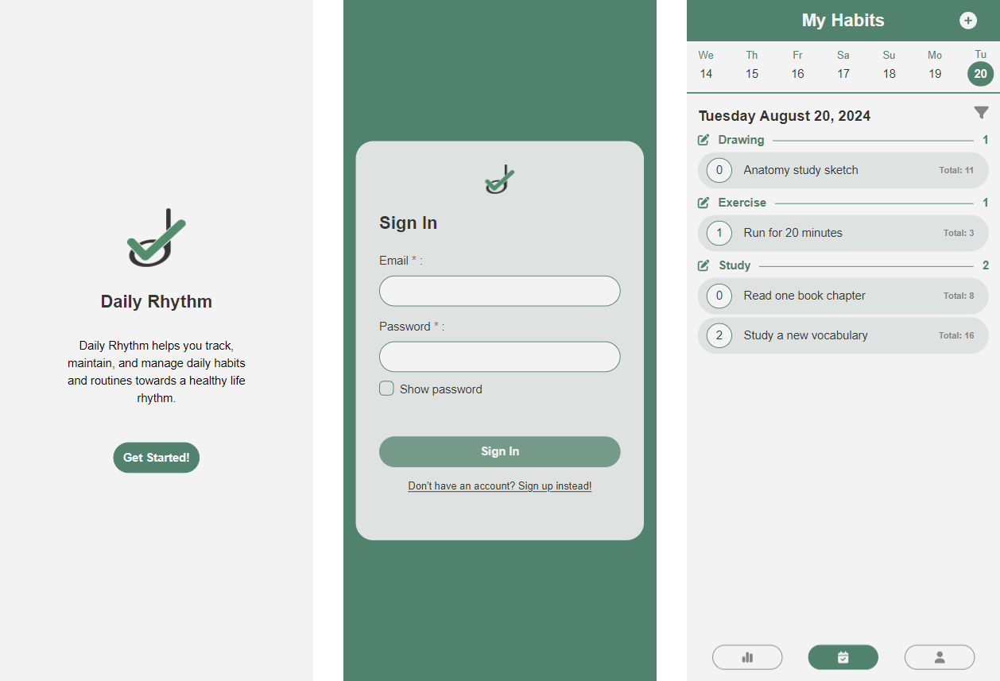
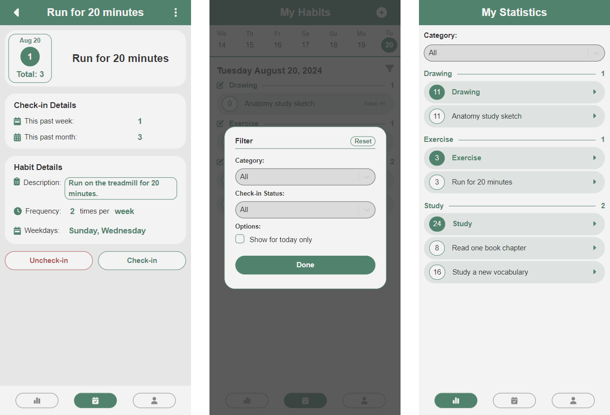
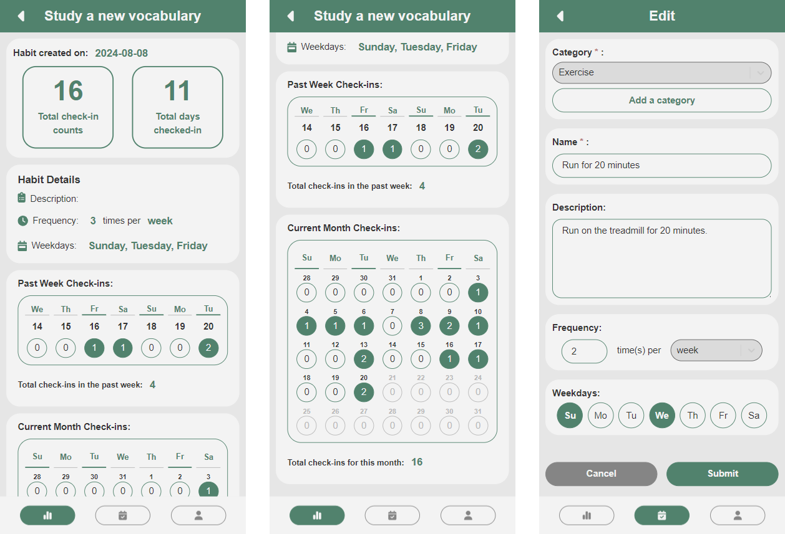
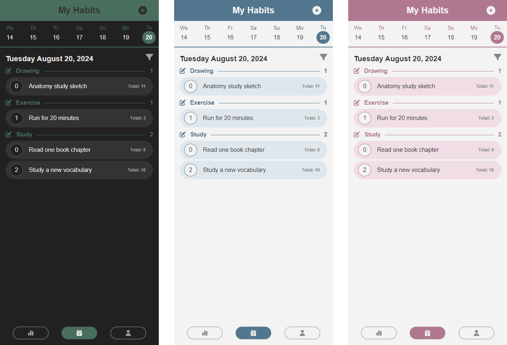
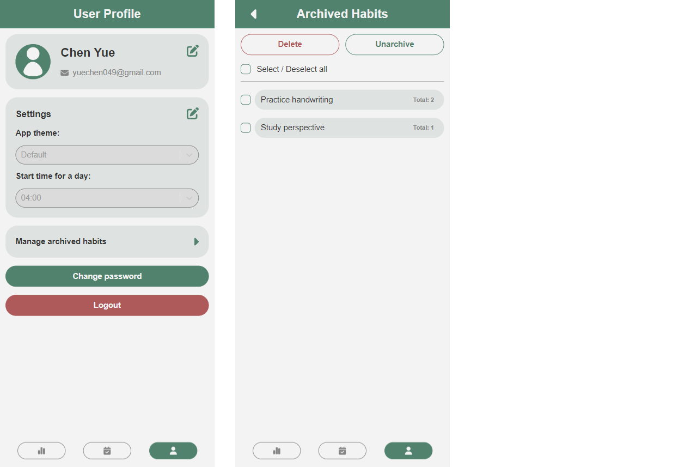

# Daily Rhythm

## Table of Contents

- [Daily Rhythm](#daily-rhythm)
  - [Table of Contents](#table-of-contents)
  - [Description](#description)
  - [Technologies Used](#technologies-used)
  - [Features of the Application](#features-of-the-application)
  - [Preview](#preview)

## Description

Daily Rhythm is a habit tracking app that helps users track, maintain, and manage their habits and daily routines towards a healthy life rhythm. 

## Technologies Used

* **Node.js and Express** are used to build the backend of the application and handle the requests to the different API endpoints.
* **PostgreSQL** is used for the database of the application, containing all user data.
* **React** is used to build the frontend of the application.
* **Tailwind CSS** is used to style the design of the application.
* **JWT tokens** are used to authenticate a user and check whether the user is signed in.

## Features of the Application

The application consists of the following pages when the user is signed out:

* **Homepage:** The home page displays the logo along with a short description of the application.
* **Sign in/sign up:** The user can sign in and create an account from the Sign in and Sign up pages. 

Once signed in, the following pages are available:

* **My Habits Page:** This page displays all the habits created by the user, separated by categories. 
  * The user can click on a habit to check-in to indicate that the habit is completed on that day. 
  * Each habit is displayed with the check-in count of the day, the habit name, and the total check-in count of the habit.
  * A weekly calendar is shown at the top where the user can use to navigate up to a week ago in case they forgot to check-in on a day.
  * A filter is available for the user to filter the habits by categories, by whether it has been checked-in on that day, and to only display habits with goals set for that day of the week. 
* **Individual Habit Details Page:** Clicking on a habit from My Habits page leads to an individual habit page, showing the details of the habit.
   * Details includes the daily check-in count, total check-in count, check-in counts for the past week and month, habit description, and goals set for the habit such as the frequency per day/week/month and the weekdays on which the habit is planned to be completed on.
   * The user can check-in or uncheck-in from this page if a habit was checked-in by accident.
   * The user can archive or delete a habit form this page.  
* **New Habit/Edit Habit Page:** This page shows a form to create new habits and update existing habits. 
  * Habits can be edited by clicking on the edit button from the Habit Details page, and new habits can be created from My Habits page by clicking on the plus icon.
  * A category must be selected and a habit name must be provided. The rest of the form are optional. 
  * The user can create new categories for their habits on this page.
* **My Statistics Page:** This page displays a list of all the users habits along with the total check-in counts. The user can click on each individual habits to see the full statistics.
* **Individual Habit Statistics Page:** This page displays all the statistics related to a user habit. 
  * The first section shows basic statistics such as the date the habit was created on, the total check-in count, and the total check-in days.
  * The next section shows the habit details such as the description, the frequency and the weekdays. 
  * The next section shows the weekly statistics including days on which the habit was checked-in in the last seven days and the total weekly check-in count.
  * Finally, the last section shows the monthly statistics including days on which the habit was checked-in during the month and the total monthly check-in count.
* **User Profile Page:** This page shows the user profile with user account information such as username and email. 
  * The user can edit their username and email.
  * The user can edit their settings, such as the app theme and the starting time for a day. 
  * The user can access the Archived Habits page from this page.
  * The user can change their password and logout from this page
* **Archived Habits Page:** This page shows all the habits that have been archived. From this page, the user can delete or unarchive the archived habits.

## Preview

Here is a preview of the app:

